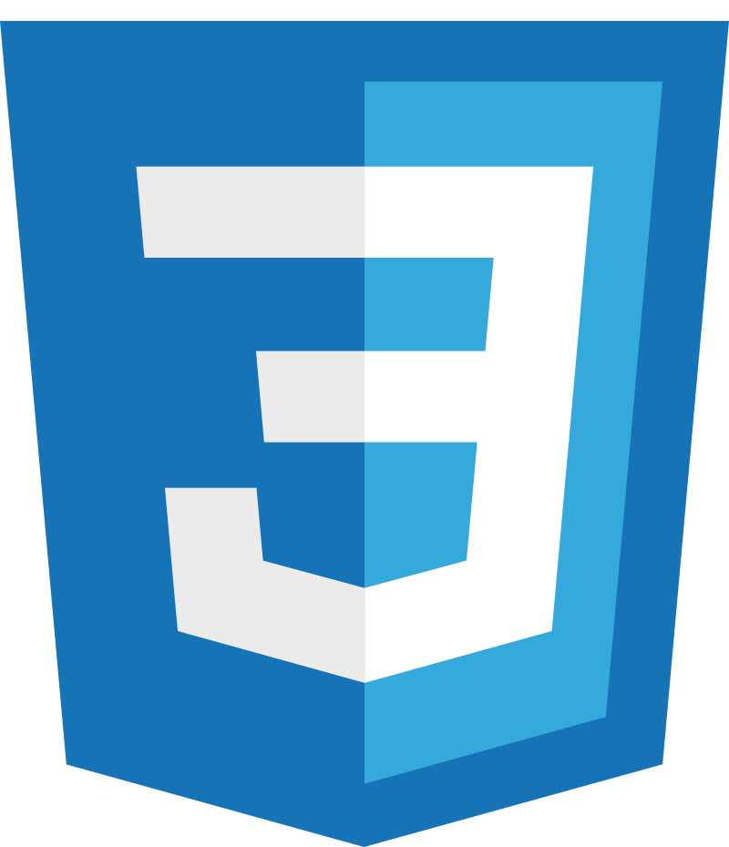
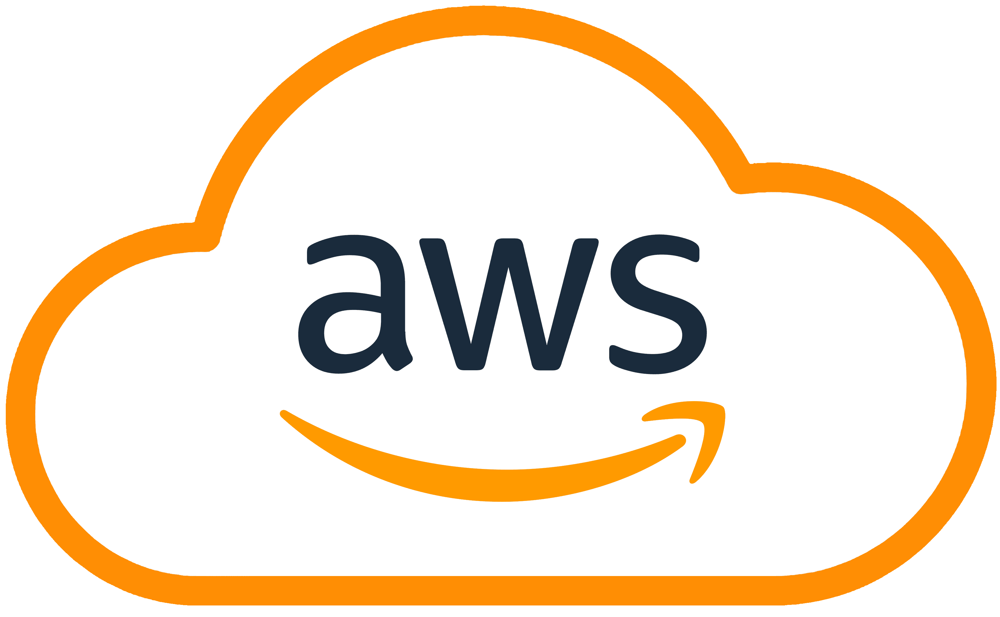

##  Hi there 👋

I’m a Computer Science undergraduate at UC Irvine with a strong focus on software engineering, machine learning, and systems. I’ve worked across backend development, distributed systems, and applied AI, building production-ready software through internships and research.

My interests include scalable system design, ML-driven applications, and building tools that turn complex data into reliable, real-world solutions.

### Backend Development
    

### Frontend Development
  

### Cloud Infrastructure/DevOps Tools
     

### Personal Portfolio
[https://vyomshah05.github.io/](https://vyomshah05.github.io/)

### LinkedIn
[https://linkedin.com/in/vyomshah1](https://linkedin.com/in/vyomshah1)
